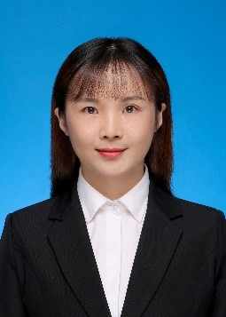

Dr. Weixia Gao
=========================

.. raw:: html

   
Weixia Gao, PhD, Research Assistant 
   Department of Bioengineering 
   College of Biotechnology, Tianjin University of Science and Technology,  
   No. 29, St.No.13 Tianjin Econmic-Technological Development Area  
   Tianjin 300457, P.R.China  
   E-mail: gaoweixia@tust.edu.cn

.. raw:: html

   

    
Weixia Gao received PhD degree on Microbiology in College of Life Science, Nankai University in 2017. Till 2019, She undertook postdoctoral research in State Key Laboratory of Medicinal Chemical Biology, Nankai University. After that, she has been working in Tianjin University of Science and Technology. She has undertaken many undergraduate and graduate courses, including Biological Separation Engineering, Microbial Genetics and Breeding Experiment and Metabolic Engineering and Synthetic Biology. Her research mainly focuses on industrial microbiology, including metabolic engineering, synthetic biology and fermentation engineering. Until now, Dr. Gao has hosted and participated more than ten projects, including National Natural Science Foundation of China. She has published more than 20 articles on SCI journals.

