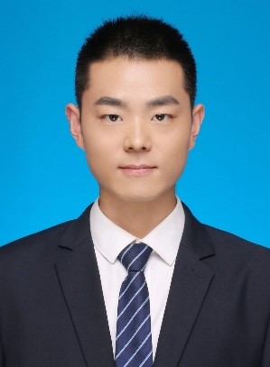

Dr. Wenchao Li
=========================

.. raw:: html

   

   
Wenchao Li, PhD, Lecturer 
   Department of Bioreaction engineering 
   College of Biotechnology, Tianjin University of Science and Technology, 
   No. 29, St.No.13 Tianjin Econmic-Technological Development Area  
   Tianjin 300457, P.R.China  
   E-mail: liwenchao@tust.edu.cn

.. raw:: html

   

    
Wenchao Li received PhD degree on Chemical engineering and technology in college of Chemical Engineering, Tianjin University in 2019. After graduation, he came to work at Tianjin University of Science and Technology. He has undertaken many undergraduate courses, including Biological separation engineering, Process Technology, and Bioreaction engineering. His research interest focuses on biorefinery, which though biotechnologies and chemical technologies, such as synthetic biology, metabolic engineering, fermentation process regulation, and chemical pretreatment to realize the utilization of agricultural and forestry wastes. Dr. Li has published more than 20 articles on SCI journals.

